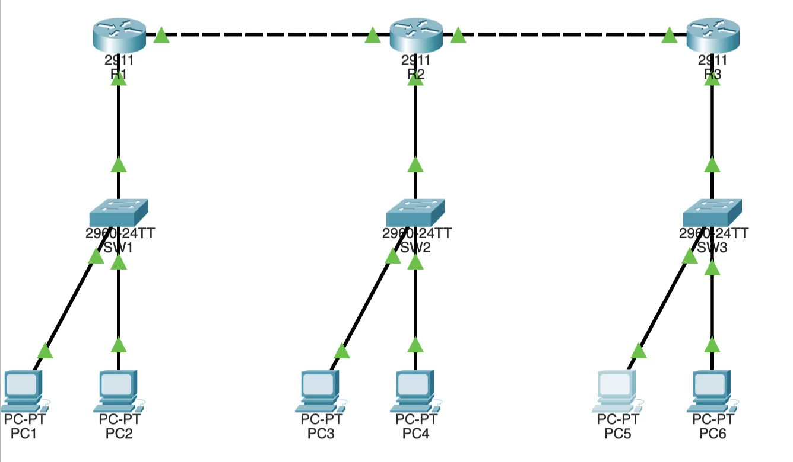
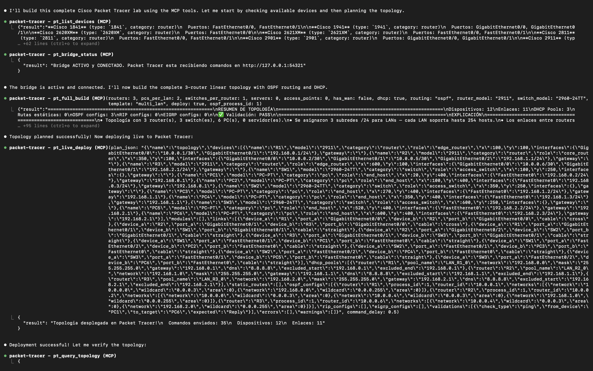
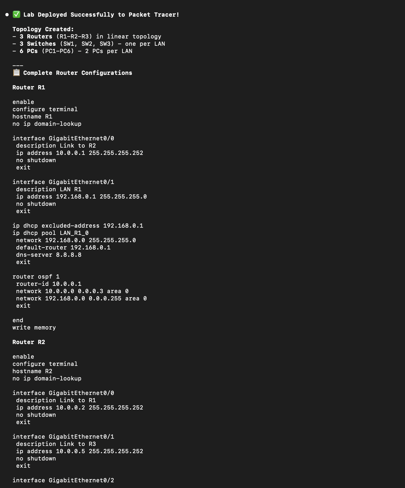
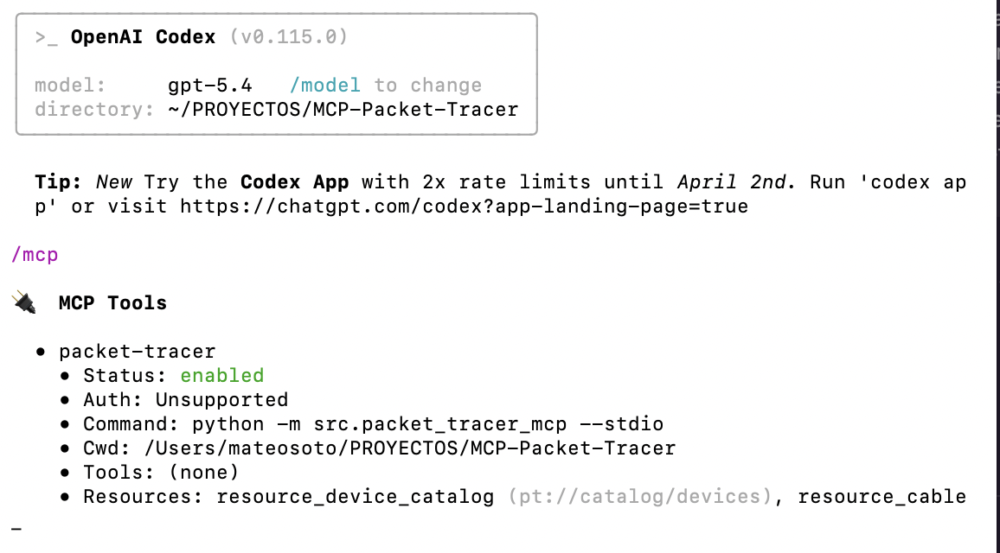
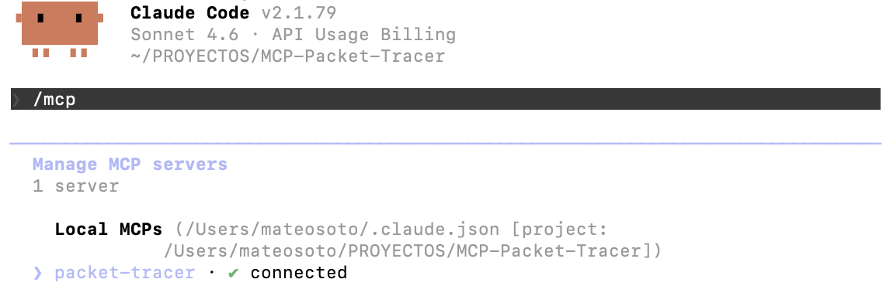
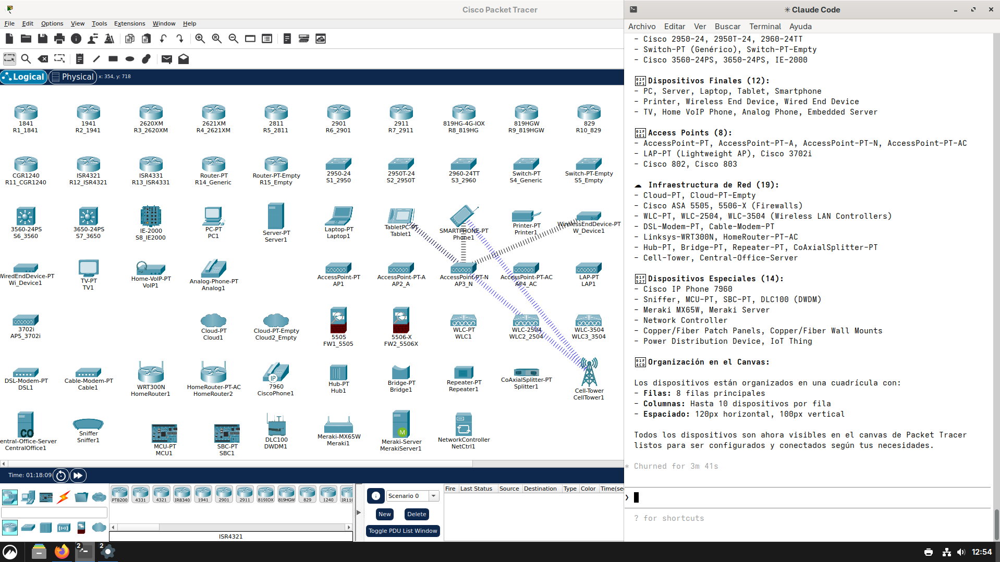
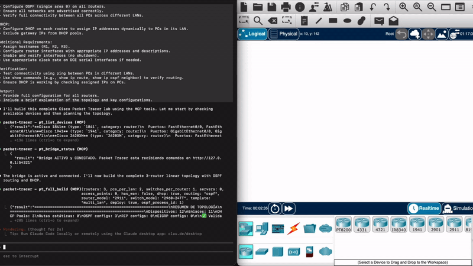

<div align="center">

#  Packet Tracer MCP Server

**Tell your AI _"create a network with 3 routers, OSPF and DHCP"_ — it plans, validates, generates, and deploys the topology directly into Cisco Packet Tracer in real time.**

[](https://github.com/Mats2208/MCP-Packet-Tracer/releases)
[](https://python.org)
[](https://docs.pydantic.dev)
[](https://modelcontextprotocol.io)
[]()
[](https://github.com/Mats2208/MCP-Packet-Tracer/blob/main/LICENSE)

[](https://lobehub.com/mcp/mats2208-mcp-packet-tracer)

<br/>

<table>
<tr>
<td align="center"><strong>27 MCP Tools</strong></td>
<td align="center"><strong>5 MCP Resources</strong></td>
<td align="center"><strong>74 Device Models</strong></td>
<td align="center"><strong>151 Modules</strong></td>
<td align="center"><strong>15 Cable Types</strong></td>
</tr>
</table>

</div>

---

## Showcase

<p align="center">
  
</p>
<p align="center"><sub>3-router linear topology with OSPF, DHCP, and 6 PCs — planned and deployed via MCP tools</sub></p>

<table>
<tr>
<td width="50%">
<p align="center"></p>
<p align="center"><sub>Full build + live deploy pipeline in VS Code</sub></p>
</td>
<td width="50%">
<p align="center"></p>
<p align="center"><sub>Auto-generated IOS CLI configs with OSPF & DHCP</sub></p>
</td>
</tr>
</table>

<details>
<summary><strong>More screenshots — MCP server in different clients</strong></summary>
<br/>

<p align="center">
  
</p>
<p align="center"><sub>MCP server running — tools and resources exposed in OpenAI Codex CLI</sub></p>

<p align="center">
  
</p>
<p align="center"><sub>MCP server connected in Claude Code — ready to receive tool calls</sub></p>

<p align="center">
  
</p>
<p align="center"><sub>MCP server connected in Claude Code on Arch Linux</sub></p>

</details>

<p align="center">
  
</p>
<p align="center"><sub>Live deploy — from natural-language prompt to running topology in Packet Tracer</sub></p>

---

## Table of Contents

- [What It Does](#-what-it-does)
- [Installation](#-installation)
- [Quick Start](#-quick-start)
- [How It Works](#-how-it-works)
- [MCP Tools (27)](#-mcp-tools)
- [MCP Resources (5)](#-mcp-resources)
- [Live Deploy Setup](#-live-deploy-setup)
- [Supported Devices (74)](#-supported-devices)
- [Cable Types (15)](#-cable-types)
- [Expansion Modules (151)](#-expansion-modules)
- [IP Addressing](#-ip-addressing)
- [Routing Protocols](#-routing-protocols)
- [Topology Templates](#-topology-templates)
- [Architecture](#-architecture)
- [Testing](#-testing)
- [Requirements](#-requirements)

---

## ◈ What It Does

A **Model Context Protocol (MCP) server** that gives any LLM (GitHub Copilot, Claude, Codex, etc.) full programmatic control over Cisco Packet Tracer. 27 MCP tools and 5 MCP resources cover the complete workflow:

```
Natural language prompt
        │
  LLM (GitHub Copilot / Claude)
        │  MCP tools
  Packet Tracer MCP Server   (:39000)
        │  HTTP bridge
  PTBuilder in Packet Tracer  (:54321)
        │  Script Engine
  Cisco Packet Tracer
  ── devices created
  ── cables connected
  ── IOS configs applied
```

**Key capabilities:**

| | Feature | Details |
|---|---------|---------|
| **Planning** | Natural-language to topology | From a single prompt to a complete `TopologyPlan` |
| **IP Addressing** | Automatic /24 LANs + /30 WAN links | Sequential assignment, gateway at `.1` |
| **DHCP** | Auto pool generation | One pool per LAN, gateway excluded |
| **Routing** | Static / OSPF / EIGRP / RIP | Full IOS command generation |
| **Validation** | 24 typed error codes + auto-fixer | Wrong cables, missing ports, model upgrades |
| **ACL** | Standard, extended and named ACLs | Apply, bind and remove ACLs on live routers |
| **NAT / PAT** | Static NAT, dynamic NAT, PAT overload | Translate addresses on live routers via bridge |
| **Deploy** | Real-time HTTP bridge to Packet Tracer | No copy-paste — commands stream directly |
| **Export** | Plans, JS scripts, CLI configs to disk | Reusable project files |
| **Catalog** | 74 devices · 151 modules · 15 cables | 34 categories, 101 aliases |

---

## ◈ Installation

```bash
git clone https://github.com/Mats2208/MCP-Packet-Tracer
cd MCP-Packet-Tracer
pip install -e .
```

---

## ◈ Quick Start

After running `pip install -e .` (see [Installation](#-installation)) the module `packet_tracer_mcp` is importable from any directory. That means **`python -m packet_tracer_mcp --stdio` works from anywhere** — no need to `cd` into the repo, no need to keep a server running in background. Most clients below use this stdio entry point and auto-launch the server on demand.

> **Two transport modes:**
> - **stdio** (recommended for desktop clients): the client spawns the server as a child process. Zero manual steps, works from any directory. The internal HTTP bridge to Packet Tracer (`:54321`) still starts automatically inside the spawned process — live deploy works the same.
> - **streamable-http** (`http://127.0.0.1:39000/mcp`): you start the server yourself with `python -m packet_tracer_mcp` and multiple clients can share the same instance. Useful for VS Code multi-window setups or remote/shared scenarios.

### 1 &mdash; Connect your MCP client

Pick your client. All examples assume you already ran `pip install -e .`.

<details open>
<summary> &ensp; <strong>One CLI command</strong></summary>

```bash
claude mcp add --scope user --transport stdio packet-tracer -- python -m packet_tracer_mcp --stdio
```

- `--scope user` registers the server in your global `~/.claude.json`, so it's available from **any** directory you launch `claude` in (not tied to a single project).
- The `--` separator passes everything after it to the spawned process verbatim.

Verify:

```bash
claude mcp list
# packet-tracer: python -m packet_tracer_mcp --stdio - ✓ Connected
```

To remove later:

```bash
claude mcp remove packet-tracer --scope user
```

</details>

<details>
<summary> &ensp; <strong>Edit <code>claude_desktop_config.json</code></strong></summary>

The config path depends on **how Claude Desktop was installed**. This matters on Windows because the Microsoft Store version sandboxes AppData and the official docs only mention the standard path.

| OS / install source | Config path |
|---|---|
| Windows — installer from [claude.ai/download](https://claude.ai/download) | `%APPDATA%\Claude\claude_desktop_config.json` |
| Windows — Microsoft Store / MSIX | `%LOCALAPPDATA%\Packages\Claude_pzs8sxrjxfjjc\LocalCache\Roaming\Claude\claude_desktop_config.json` |
| macOS | `~/Library/Application Support/Claude/claude_desktop_config.json` |
| Linux | `~/.config/Claude/claude_desktop_config.json` |

> **How to tell which install you have on Windows:** run `Get-Process claude \| Select-Object -ExpandProperty Path` in PowerShell. If the path contains `WindowsApps\Claude_*`, you have MSIX — use the second row above. Otherwise use the first.

Add (or merge into the existing file):

```json
{
  "mcpServers": {
    "packet-tracer": {
      "command": "python",
      "args": ["-m", "packet_tracer_mcp", "--stdio"]
    }
  }
}
```

After saving, **fully quit** Claude Desktop and reopen — closing the window is not enough if "run in background" is on. On Windows: right-click the tray icon → **Quit**, or run `Get-Process claude | Stop-Process -Force`.

> **Windows / MSIX gotcha:** the sandbox may not expose `python` on PATH. If the MCP indicator never lights up, replace `"python"` with the absolute path to your interpreter:
> ```json
> "command": "C:\\Users\\YOU\\AppData\\Local\\Programs\\Python\\Python312\\python.exe"
> ```
> Find your interpreter with `where.exe python` (PowerShell) or `which python` (bash/zsh). Logs are at `<config-dir>\logs\mcp-server-packet-tracer.log`.

</details>

<details>
<summary> &ensp; <strong>Edit <code>~/.codex/config.toml</code></strong></summary>

OpenAI Codex CLI uses TOML, not JSON. Open `~/.codex/config.toml` (Windows: `%USERPROFILE%\.codex\config.toml`) and append:

```toml
[mcp_servers.packet-tracer]
command = "python"
args = ["-m", "packet_tracer_mcp", "--stdio"]
```

Restart your `codex` session. Codex picks up MCP servers on launch.

</details>

<details>
<summary> &ensp; <strong><code>.vscode/mcp.json</code> (Copilot, Continue, Cline)</strong></summary>

Two options. **stdio** is the simplest — VS Code spawns the server when needed:

```json
{
  "servers": {
    "packet-tracer": {
      "type": "stdio",
      "command": "python",
      "args": ["-m", "packet_tracer_mcp", "--stdio"]
    }
  }
}
```

**streamable-http** if you want to keep one server running outside VS Code (e.g. shared across multiple windows):

```json
{
  "servers": {
    "packet-tracer": {
      "url": "http://127.0.0.1:39000/mcp"
    }
  }
}
```

For HTTP, start the server first in any terminal: `python -m packet_tracer_mcp`. Default endpoint is `http://127.0.0.1:39000/mcp` and the bridge runs at `:54321`.

</details>

<details>
<summary> &ensp; <strong><code>.cursor/mcp.json</code></strong></summary>

Per-user (global): `~/.cursor/mcp.json`. Per-project: `<workspace>/.cursor/mcp.json`.

```json
{
  "mcpServers": {
    "packet-tracer": {
      "command": "python",
      "args": ["-m", "packet_tracer_mcp", "--stdio"]
    }
  }
}
```

Reload the Cursor window after saving (Cmd/Ctrl+Shift+P → "Reload Window").

</details>

<details>
<summary><strong>◇ Generic stdio template — any other MCP client</strong></summary>

The vast majority of MCP clients accept the same three fields. Translate to whatever syntax your client expects:

| Field | Value |
|---|---|
| `command` | `python` (or absolute interpreter path on sandboxed/MSIX systems) |
| `args` | `["-m", "packet_tracer_mcp", "--stdio"]` |
| `transport` / `type` | `stdio` |

For HTTP-only clients, start the server with `python -m packet_tracer_mcp` and point the client at `http://127.0.0.1:39000/mcp`.

</details>

### 2 &mdash; Ask your LLM to build a network

```
"Create a network with 2 routers, 2 switches, 4 PCs, DHCP and static routing"
```

The server handles the rest: **planning → validation → generation → deploy**.

> For live deploy into a running Packet Tracer instance, also paste the [bootstrap snippet](#-live-deploy-setup) once into PT's *Builder Code Editor*. The MCP tools work even without it (you can still plan, generate scripts and configs, and export to disk).

---

## ◈ How It Works

### Data Flow

```
TopologyRequest
      │
  Orchestrator ─── IPPlanner (assigns /24 LANs + /30 inter-router links)
      │
  Validator    ─── 15 typed error codes, port/cable/IP checks
      │
  AutoFixer    ─── fixes wrong cables, upgrades routers, reassigns ports
      │
  TopologyPlan (validated, fully addressed)
      │
  ┌──────────────────┬──────────────────────┬──────────────────────┐
  ▼                  ▼                      ▼                      ▼
addDevice()      addModule()            addLink()        configureIosDevice()
(place device)   (HWIC/NIM/NM)          (cable)          configurePcIp()
  │                  │                      │                      │
PTBuilder Script ── sent via HTTP bridge ─▶ Packet Tracer Script Engine
```

### Why Port 39000?

<details>
<summary>Design rationale</summary>

The server uses **streamable-http** instead of stdio. This means:
- **Persistent** — stays running, not restarted per editor session
- **Multiple clients** — VS Code, Claude Desktop, and others can connect simultaneously
- **Shared state** — the HTTP bridge to Packet Tracer stays alive across requests
- **Debuggable** — `curl http://127.0.0.1:39000/mcp` or tail logs in the terminal
- **Decoupled** — server lifecycle is independent from the editor

Port 39000 was chosen to avoid collisions with common ports (3000, 5000, 8000, 8080) and the internal bridge at 54321.

</details>

---

## ◈ MCP Tools

27 tools across 9 groups.

### Catalog

| Tool | Description |
|------|-------------|
| `pt_list_devices` | Lists all 74 supported devices with their port specs |
| `pt_list_templates` | Lists available topology templates |
| `pt_get_device_details` | Full port/interface details for a specific model |

### Estimation

| Tool | Description |
|------|-------------|
| `pt_estimate_plan` | Dry-run: counts devices, links, configs without generating the full plan |

### Planning

| Tool | Description |
|------|-------------|
| `pt_plan_topology` | Generates a complete `TopologyPlan` — devices, links, IPs, DHCP, routes, modules |

> `pt_plan_topology` returns machine-readable JSON. Use its output as input for all downstream tools.

### Validation & Fixing

| Tool | Description |
|------|-------------|
| `pt_validate_plan` | Validates a plan against 24 typed error codes |
| `pt_fix_plan` | Auto-corrects common errors (wrong cables, missing ports, model upgrades) |
| `pt_explain_plan` | Returns a natural-language explanation of every decision in the plan |

### Generation

| Tool | Description |
|------|-------------|
| `pt_generate_script` | Generates the PTBuilder JavaScript script (`addDevice`, `addModule`, `addLink`) |
| `pt_generate_configs` | Generates per-device IOS CLI config blocks |

### Full Pipeline

| Tool | Description |
|------|-------------|
| `pt_full_build` | All-in-one: plan + validate + generate + explain + estimate in a single call |

> `pt_full_build` returns a human-readable report. It includes the JSON plan at the end for reference but is **not** intended as direct JSON input for other tools. Use `pt_plan_topology` for that.

### Live Deploy

| Tool | Description |
|------|-------------|
| `pt_deploy` | Copies the script to clipboard with paste-in instructions |
| `pt_live_deploy` | Sends commands directly to Packet Tracer via the HTTP bridge |
| `pt_bridge_status` | Checks if the bridge is active and PTBuilder is polling |

### Topology Interaction

| Tool | Description |
|------|-------------|
| `pt_query_topology` | Reads currently loaded devices from Packet Tracer |
| `pt_delete_device` | Removes a device and all its links from PT |
| `pt_rename_device` | Renames a device in the active topology |
| `pt_move_device` | Moves a device to new canvas coordinates |
| `pt_delete_link` | Removes the link on a specific interface |
| `pt_send_raw` | Sends arbitrary JavaScript to the PT Script Engine |

### Export & Projects

| Tool | Description |
|------|-------------|
| `pt_export` | Exports plan, JS script and CLI configs to files |
| `pt_list_projects` | Lists saved projects |
| `pt_load_project` | Loads a previously saved project |

### ACL

Apply and remove Access Control Lists on live routers via the HTTP bridge. Works independently of `pt_live_deploy` — you can add ACLs to any existing topology.

| Tool | Description |
|------|-------------|
| `pt_apply_acl` | Applies a standard, extended or named ACL to a router interface. Validates number ranges, wildcard masks, protocol/port coherence and unreachable rules before sending |
| `pt_remove_acl` | Removes an ACL (and optionally its interface binding) from a router |

> **When to use each type:** Standard ACL (1–99) — filter by source IP only. Extended ACL (100–199) — filter by source, destination, protocol and ports. Named ACL — any string identifier, easier to read and edit in IOS.

### NAT / PAT

Configure address translation on live routers via the HTTP bridge. Three modes map directly to the three IOS NAT variants taught in CCNA.

| Tool | Description |
|------|-------------|
| `pt_apply_nat` | Applies Static NAT, Dynamic NAT or PAT (NAT Overload) to a router. Marks inside/outside interfaces, generates the ACL and pool inline, validates IPs and pool ranges |
| `pt_remove_nat` | Removes NAT translation rules, pool and ACL from a router and unmarks its interfaces |

> **When to use each mode:**
> - `static` — one private IP always maps to the same public IP. Use for servers that must be reachable from the internet with a fixed address.
> - `dynamic` — pool of public IPs assigned on demand. Use when you have more public IPs than PAT justifies but fewer than private hosts.
> - `pat` — many private IPs share one public IP using port numbers. Use in virtually every home and enterprise network (`use_interface_overload=True` uses the WAN interface IP directly).

---

## ◈ MCP Resources

5 read-only catalog resources accessible by any MCP client.

| URI | Description |
|-----|-------------|
| `pt://catalog/devices` | All 74 devices with ports and categories |
| `pt://catalog/cables` | Cable types and inference rules |
| `pt://catalog/aliases` | Model name aliases (e.g. `"router"` -> `"2911"`) |
| `pt://catalog/templates` | Topology templates with default parameters |
| `pt://capabilities` | Server version and supported features |

---

## ◈ Live Deploy Setup

The live deploy feature sends commands directly to a running Packet Tracer instance. No copy-pasting needed.

```
┌──────────┐  MCP   ┌──────────────────┐  HTTP   ┌─────────────────┐  $se()  ┌──────────────┐
│   LLM    │ ─────▶ │  MCP Server      │ ──────▶ │  PTBuilder      │ ──────▶ │ Packet Tracer│
│ Copilot  │        │  :39000          │ :54321  │  (WebView)      │  IPC    │  (Engine)    │
└──────────┘        └──────────────────┘         └─────────────────┘         └──────────────┘
```

| Port | Service | Purpose |
|------|---------|---------|
| **39000** | MCP server (streamable-http) | Receives tool calls from the LLM or editor |
| **54321** | HTTP bridge | Queues JS commands for PTBuilder to execute in PT |

### Setup (once per PT session)

1. Open **Cisco Packet Tracer 8.2+**
2. Go to **Extensions → Builder Code Editor**
3. Paste this bootstrap script and click **Run**:

```javascript
/* PT-MCP Bridge */ window.webview.evaluateJavaScriptAsync("setInterval(function(){var x=new XMLHttpRequest();x.open('GET','http://127.0.0.1:54321/next',true);x.onload=function(){if(x.status===200&&x.responseText){$se('runCode',x.responseText)}};x.onerror=function(){};x.send()},500)");
```

This injects a `setInterval` into the PTBuilder webview that polls the bridge every 500 ms. When the MCP server queues a command, PTBuilder picks it up and runs it in PT's Script Engine via `$se('runCode', ...)`.

> **Technical note:** PTBuilder's `executeCode()` strips newlines internally (`code.replace(/\n/g, "")`), which is why the bootstrap uses `/* */` block comments instead of `//` line comments.

---

## ◈ Supported Devices

74 device models across 34 categories.

### Routers (15)

<details>
<summary>Click to expand router models</summary>

| Model | Ports | Interface Name Format |
|-------|-------|----------------------|
| `1841` | 2x FastEthernet | Fa0/0, Fa0/1 |
| `1941` | 2x GigabitEthernet | Gig0/0, Gig0/1 |
| `2620XM` | 1x FastEthernet | Fa0/0 |
| `2621XM` | 2x FastEthernet | Fa0/0, Fa0/1 |
| `2811` | 2x FastEthernet | Fa0/0, Fa0/1 |
| `2901` | 2x GigabitEthernet | Gig0/0, Gig0/1 |
| **`2911`** | **3x GigabitEthernet** | **Gig0/0, Gig0/1, Gig0/2 — Default** |
| `819HG-4G-IOX` | 1x Gig + 1x Fa | Gig0, Fa0 |
| `819HGW` | 1x Gig + 1x Fa | Gig0, Fa0 |
| `829` | 2x GigabitEthernet | Gig0, Gig1 |
| `CGR1240` | 2x GigabitEthernet | Gig0/0, Gig0/1 |
| `ISR4321` | 2x GigabitEthernet | Gig0/0/0, Gig0/0/1 |
| `ISR4331` | 3x GigabitEthernet | Gig0/0/0, Gig0/0/1, Gig0/0/2 |
| `Router-PT` | 2x FastEthernet | Fa0/0, Fa0/1 — Generic |
| `Router-PT-Empty` | none | No ports (add via modules) |

> **Note:** No router has Serial ports by default. Serial requires physical HWIC or NIM modules — see [Expansion Modules](#-expansion-modules).

</details>

### Switches — Layer 2 (5)

<details>
<summary>Click to expand all device categories (Switches, End Devices, APs, Security, WLC, Cloud, etc.)</summary>

#### Switches — Layer 2

| Model | Ports | Notes |
|-------|-------|-------|
| `2950-24` | 24x Fa0/1-24 | Basic L2 |
| `2950T-24` | 24x Fa0/1-24 + 2x Gig0/1-2 | |
| **`2960-24TT`** | 24x Fa0/1-24 + 2x Gig0/1-2 | **Default switch** |
| `Switch-PT` | 8x Fa0/0-7 | Generic |
| `Switch-PT-Empty` | none | No ports (add via modules) |

#### Switches — Layer 3 (3)

| Model | Ports | Notes |
|-------|-------|-------|
| `3560-24PS` | 24x Fa0/1-24 + 2x Gig0/1-2 | L3 routing capable |
| `3650-24PS` | 24x Fa0/1-24 + 2x Gig0/1-2 | L3 routing capable |
| `IE-2000` | 8x Fa0/1-8 + 2x Gig0/1-2 | Industrial Ethernet |

#### End Devices (12)

| Model | Category | Port | Notes |
|-------|----------|------|-------|
| `PC-PT` | `pc` | FastEthernet0 | |
| `Server-PT` | `server` | FastEthernet0 | |
| `Laptop-PT` | `laptop` | FastEthernet0 | |
| `TabletPC-PT` | `pc` | FastEthernet0 | |
| `SMARTPHONE-PT` | `pc` | FastEthernet0 | |
| `Printer-PT` | `pc` | FastEthernet0 | |
| `WirelessEndDevice-PT` | `wireless_end_device` | — | Wireless-only end device |
| `WiredEndDevice-PT` | `wired_end_device` | FastEthernet0 | |
| `TV-PT` | `tv` | FastEthernet0 | |
| `Home-VoIP-PT` | `voip` | FastEthernet0 | Home VoIP phone |
| `Analog-Phone-PT` | `analog_phone` | Phone0 | |
| `Embedded-Server-PT` | `embedded_server` | FastEthernet0 | |

#### Access Points & Wireless (8)

| Model | Category | Ports | Notes |
|-------|----------|-------|-------|
| `AccessPoint-PT` | `accesspoint` | Port 0 | Standard AP |
| `AccessPoint-PT-A` | `accesspoint` | Port 0 | 802.11a |
| `AccessPoint-PT-N` | `accesspoint` | Port 0 | 802.11n |
| `AccessPoint-PT-AC` | `accesspoint` | Port 0 | 802.11ac |
| `LAP-PT` | `accesspoint` | Port 0 | Lightweight AP (managed by WLC) |
| `3702i` | `accesspoint` | GigabitEthernet0 | Cisco 3702i AP |
| `802` | `accesspoint` | Fa0 | Cisco 802 Wireless Bridge |
| `803` | `accesspoint` | Fa0 | Cisco 803 Wireless Bridge |

#### Security (2)

| Model | Category | Ports | Notes |
|-------|----------|-------|-------|
| `5505` | `firewall` | 8x Fa0/0-Fa0/7 | Cisco ASA 5505 |
| `5506-X` | `firewall` | 8x Gig1/0-Gig1/7 | Cisco ASA 5506-X — Default |

#### Wireless LAN Controllers (3)

| Model | Category | Ports | Notes |
|-------|----------|-------|-------|
| `WLC-PT` | `wlc` | Gig1-Gig8 | Generic WLC |
| `WLC-2504` | `wlc` | Gig1-Gig4 | Cisco WLC 2504 |
| `WLC-3504` | `wlc` | Gig1-Gig4 | Cisco WLC 3504 |

#### Cloud / WAN (2)

| Model | Category | Ports | Notes |
|-------|----------|-------|-------|
| `Cloud-PT` | `cloud` | Ethernet6 | WAN simulation |
| `Cloud-PT-Empty` | `cloud` | none | Empty cloud (add via modules) |

#### Network Connectivity (4)

| Model | Category | Ports | Notes |
|-------|----------|-------|-------|
| `Hub-PT` | `hub` | Port 0-7 (8 ports) | Layer 1 hub |
| `Bridge-PT` | `bridge` | Port 0, Port 1 | |
| `Repeater-PT` | `repeater` | Port 0, Port 1 | |
| `CoAxialSplitter-PT` | `splitter` | Coaxial0-3 | 4-port coaxial splitter |

#### Modems (2)

| Model | Category | Ports | Notes |
|-------|----------|-------|-------|
| `DSL-Modem-PT` | `modem` | Ethernet0, Coaxial0 | |
| `Cable-Modem-PT` | `modem` | Ethernet0, Coaxial0 | |

#### Home / Consumer Routers (2)

| Model | Category | Ports | Notes |
|-------|----------|-------|-------|
| `Linksys-WRT300N` | `wireless_router` | Internet + 4x Ethernet | Linksys WRT300N |
| `HomeRouter-PT-AC` | `home_gateway` | Internet + 4x Ethernet | Home Router AC |

#### IP Phone (1)

| Model | Category | Ports | Notes |
|-------|----------|-------|-------|
| `7960` | `ip_phone` | Port 0 (switch), PC Port | Cisco IP Phone 7960 |

#### Meraki / SDN (2)

| Model | Category | Ports | Notes |
|-------|----------|-------|-------|
| `Meraki-MX65W` | `meraki` | 12x GigabitEthernet | Meraki MX65W |
| `Meraki-Server` | `meraki` | Gig0 | Meraki Dashboard Server |

#### Network Controllers (2)

| Model | Category | Ports | Notes |
|-------|----------|-------|-------|
| `NetworkController` | `network_controller` | Gig0 | Generic SDN controller |
| `DLC100` | `network_controller` | Fa0 | DWDM DLC-100 |

#### Telecom / Special (3)

| Model | Category | Ports | Notes |
|-------|----------|-------|-------|
| `Cell-Tower` | `cell_tower` | Coaxial0 | Cellular tower |
| `Central-Office-Server` | `central_office` | Ethernet0 | Telco central office |
| `Sniffer` | `sniffer` | FastEthernet0 | Packet capture |

#### Embedded / IoT (3)

| Model | Category | Ports | Notes |
|-------|----------|-------|-------|
| `MCU-PT` | `mcu` | — | Microcontroller (no fixed ports) |
| `SBC-PT` | `sbc` | FastEthernet0 | Single Board Computer |
| `Thing` | `iot` | — | Generic IoT device (represents ~80 IoT types) |

#### Physical Infrastructure (7)

| Model | Category | Ports | Notes |
|-------|----------|-------|-------|
| `Copper Patch Panel` | `patch_panel` | 24x FastEthernet | |
| `Fiber Patch Panel` | `patch_panel` | 24x Fiber | |
| `Copper Wall Mount` | `wall_mount` | Fa0, Fa1 | |
| `Fiber Wall Mount` | `wall_mount` | Fiber0, Fiber1 | |
| `Power Distribution Device` | `power_dist` | — | |

#### Device Aliases

101 aliases total — common names the LLM can use that resolve to actual models:

| Alias | Resolves to | Alias | Resolves to |
|-------|-------------|-------|-------------|
| `router` | `2911` | `switch` | `2960-24TT` |
| `pc`, `computer` | `PC-PT` | `server` | `Server-PT` |
| `laptop` | `Laptop-PT` | `tablet` | `TabletPC-PT` |
| `smartphone`, `phone` | `SMARTPHONE-PT` | `printer` | `Printer-PT` |
| `cloud`, `wan` | `Cloud-PT` | `ap`, `wifi` | `AccessPoint-PT` |
| `hub` | `Hub-PT` | `firewall`, `asa` | `5506-X` |
| `wlc`, `wireless_controller` | `WLC-PT` | `lap`, `lightweight_ap` | `LAP-PT` |
| `dsl`, `modem` | `DSL-Modem-PT` | `cable_modem` | `Cable-Modem-PT` |
| `2911`, `2901`, `1941` | (direct) | `isr4321`, `4321` | `ISR4321` |
| `3560`, `3650`, `ie2000` | (direct) | `5505`, `5506`, `5506x` | (direct) |
| `ip_phone`, `7960` | `7960` | `meraki` | `Meraki-MX65W` |
| `bridge` | `Bridge-PT` | `repeater` | `Repeater-PT` |
| `sniffer` | `Sniffer` | `mcu`, `microcontroller` | `MCU-PT` |
| `sbc`, `raspberry` | `SBC-PT` | `iot`, `thing`, `sensor` | `Thing` |
| `meraki_server` | `Meraki-Server` | `network_controller` | `NetworkController` |
| `linksys`, `wrt300n` | `Linksys-WRT300N` | `home_router` | `HomeRouter-PT-AC` |
| `tv` | `TV-PT` | `voip`, `home_voip` | `Home-VoIP-PT` |
| `analog_phone` | `Analog-Phone-PT` | `patch_panel` | `Copper Patch Panel` |
| `cell_tower` | `Cell-Tower` | `dwdm`, `dlc100` | `DLC100` |

See `infrastructure/catalog/aliases.py` for the full 101-entry list.

</details>

---

## ◈ Cable Types

The server infers the correct cable automatically from the two device categories. You can also specify it explicitly.

### Supported Cable Types (validated, usable in plans)

| Cable | PT Code | Typical Use | Auto-inferred? |
|-------|---------|-------------|----------------|
| `straight` | 8100 | Switch <-> Router, Switch <-> PC/Server/AP, Hub <-> any | Yes |
| `cross` | 8101 | Router <-> Router, Switch <-> Switch, Router <-> Firewall | Yes |
| `serial` | 8106 | Router Serial <-> Router Serial (requires HWIC/NIM module) | No — explicit |
| `fiber` | 8103 | Fiber optic connections | No — explicit |
| `console` | 8108 | PC/Laptop management access to Router/Switch | No — explicit |
| `phone` | 8104 | VoIP phone connections | No — explicit |
| `coaxial` | 8110 | Cable modems (Coaxial0 port) | Yes (modem) |
| `auto` | 8107 | PT auto-detects the correct cable type | — |

### Cable Inference Rules

<details>
<summary>Click to expand inference rules and PT link codes</summary>

| Category A | Category B | Inferred Cable |
|-----------|-----------|---------------|
| router | switch | straight |
| router | router | cross |
| router | cloud | straight |
| router | firewall | cross |
| router | hub | straight |
| switch | switch | cross |
| switch | pc / server / laptop | straight |
| switch | accesspoint | straight |
| switch | firewall / wlc | straight |
| hub | any | straight |
| modem | router / cloud | straight |
| modem | modem (coaxial) | coaxial |
| wlc | accesspoint | straight |

### All PT Link Type Codes (reference)

| Cable | PT Code | Notes |
|-------|---------|-------|
| `straight` | 8100 | Straight-through Ethernet |
| `cross` | 8101 | Crossover Ethernet |
| `roll` | 8102 | Rollover cable |
| `fiber` | 8103 | Fiber optic |
| `phone` | 8104 | VoIP phone cable |
| `cable` | 8105 | Cable TV coax |
| `serial` | 8106 | Serial (DTE/DCE) |
| `auto` | 8107 | Auto-detect |
| `console` | 8108 | Console / management |
| `wireless` | 8109 | Wireless link (implicit in AP) |
| `coaxial` | 8110 | Coaxial |
| `octal` | 8111 | Octal cable (async serial) |
| `cellular` | 8112 | Cellular connection |
| `usb` | 8113 | USB cable |
| `custom_io` | 8114 | Custom I/O (IoT) |

</details>

---

## ◈ Expansion Modules

151 expansion modules across 26 module categories. They add extra ports to devices at runtime. The generator emits `addModule()` calls **after** `addDevice()` and **before** `addLink()`, which is the required PTBuilder execution order.

```javascript
addDevice("R1", "2911", 100, 100);
addModule("R1", 0, "HWIC-2T");       // installs 2 serial ports in slot 0
addLink("R1", "Serial0/0/0", "R2", "Serial0/0/0", "serial");
```

### HWIC / WIC Modules — for 1941, 2901, 2911

<details>
<summary>Click to expand module details (HWIC, NIM, NM, SFP, and more)</summary>

#### HWIC / WIC Modules

| Module | Slot Type | Ports Added | Description |
|--------|-----------|-------------|-------------|
| `HWIC-2T` | HWIC | Serial0/0/0, Serial0/0/1 | 2-port Serial WAN — most common |
| `HWIC-4ESW` | HWIC | Fa0/1/0-Fa0/1/3 | 4-port Ethernet switch |
| `HWIC-1GE-SFP` | HWIC | GigabitEthernet0/0/0 | 1-port GigE SFP |
| `HWIC-AP-AG-B` | HWIC | (wireless, no physical port) | Integrated wireless AP |
| `HWIC-8A` | HWIC | Async0/0/0-0/0/7 | 8-port async serial |
| `WIC-1T` | WIC | Serial0/0/0 | 1-port Serial |
| `WIC-2T` | WIC | Serial0/0/0, Serial0/0/1 | 2-port Serial |

#### NIM Modules — for ISR4321, ISR4331

| Module | Slot Type | Ports Added | Description |
|--------|-----------|-------------|-------------|
| `NIM-2T` | NIM | Serial0/1/0, Serial0/1/1 | 2-port Serial for ISR 4000 series |
| `NIM-ES2-4` | NIM | Gig0/1/0-Gig0/1/3 | 4-port GE Layer 2 |
| `NIM-Cover` | NIM | — | NIM slot cover plate |

#### NM Modules — legacy routers (14 total)

| Module | Slot Type | Ports Added | Description |
|--------|-----------|-------------|-------------|
| `NM-1E` | NM | Ethernet1/0 | 1-port Ethernet |
| `NM-1FE-TX` | NM | FastEthernet1/0 | 1-port FastEthernet (copper) |
| `NM-1FE-FX` | NM | FastEthernet1/0 | 1-port FastEthernet (fiber) |
| `NM-2FE2W` | NM | Fa1/0, Fa1/1 | 2-port FastEthernet + 2 WIC slots |
| `NM-4E` | NM | Eth1/0-1/3 | 4-port Ethernet |
| `NM-4A/S` | NM | Serial1/0-1/3 | 4-port Async/Sync Serial |
| `NM-8A/S` | NM | Serial1/0-1/7 | 8-port Async/Sync Serial |
| `NM-8AM` | NM | Modem1/0-1/7 | 8-port Analog Modem |
| `NM-ESW-161` | NM | Fa1/0-Fa1/15 | 16-port Ethernet switch module |

#### Other Module Families

The catalog contains 151 modules total across all device types:

| Module Family | Count | Applies To |
|---------------|-------|------------|
| Router NM (Type 1) | 14 | Legacy routers |
| Router HWIC/WIC/NIM (Type 2) | 16 | 1941, 2901, 2911, ISR4321/4331 |
| PT Router NM (Type 3) | 9 | Router-PT |
| PT Switch NM (Type 4) | 8 | Switch-PT |
| PT Cloud NM (Type 5) | 8 | Cloud-PT |
| PT Repeater NM (Type 6) | 6 | Repeater-PT |
| PT Host NM (Type 7) | 12 | PC-PT, Server-PT |
| PT Modem NM (Type 8) | 3 | DSL/Cable Modem |
| PT Laptop NM (Type 9) | 11 | Laptop-PT |
| PT TabletPC NM (Type 12) | 10 | TabletPC-PT |
| PT PDA/Smartphone NM (Type 13) | 10 | SMARTPHONE-PT |
| PT Wireless End Device NM (Type 14) | 8 | WirelessEndDevice-PT |
| PT Wired End Device NM (Type 15) | 7 | WiredEndDevice-PT |
| SFP modules (Type 30) | 5 | 3560, 3650, ISR4000 |
| Built-in factory modules (Type 32) | 5 | 3650, ISR4321/4331 |
| IoT / Cell / Audio / Power | 17 | IoT, Cell Tower, IP Phone, AP |

See `infrastructure/catalog/modules.py` for the complete list.

#### Automatic serial module selection

When serial routing is required, the server picks the right module automatically:

| Router Model | Auto-selected Module |
|-------------|---------------------|
| `1941` | `HWIC-2T` |
| `2901` | `HWIC-2T` |
| `2911` | `HWIC-2T` |
| `ISR4321` | `NIM-2T` |
| `ISR4331` | `NIM-2T` |

</details>

---

## ◈ IP Addressing

The IP planner assigns addresses automatically. No manual configuration needed.

| Network | Base | Prefix | Hosts per subnet |
|---------|------|--------|-----------------|
| LAN subnets | `192.168.0.0/16`, sequential /24 | /24 | 254 per LAN |
| Inter-router links | `10.0.0.0/16`, sequential /30 | /30 | 2 per link |

**Rules:**
- Gateway is always `.1` on each LAN subnet
- PCs, Laptops and Servers get sequential IPs starting from `.2`
- DHCP pools are created per LAN with the gateway excluded from the pool
- DNS defaults to `8.8.8.8`

**Example — 2 routers, 2 LANs:**
```
LAN 1: 192.168.0.0/24  ->  R1 Gig0/0: 192.168.0.1 | PC1: 192.168.0.2 | PC2: 192.168.0.3
LAN 2: 192.168.1.0/24  ->  R2 Gig0/0: 192.168.1.1 | PC3: 192.168.1.2 | PC4: 192.168.1.3
Link:  10.0.0.0/30     ->  R1 Gig0/1: 10.0.0.1    | R2 Gig0/1: 10.0.0.2
```

---

## ◈ Routing Protocols

All 4 IGPs are fully implemented and generate real IOS commands.

| Protocol | Key | Generated IOS Commands |
|----------|-----|----------------------|
| Static | `static` | `ip route {dest} {mask} {next_hop} [AD]` |
| OSPF | `ospf` | `router ospf {pid}`, `router-id`, `network {net} {wildcard} area 0` |
| EIGRP | `eigrp` | `router eigrp {AS}`, `network {net} {wildcard}`, `no auto-summary` |
| RIP v2 | `rip` | `router rip`, `version 2`, `network {net}`, `no auto-summary` |
| None | `none` | (no routing config generated) |

**Floating static routes** (backup routes with AD=254) are supported — set `floating_routes: true` in the request.

Static routing uses **BFS** to compute multi-hop destination reachability, so even in topologies with 4+ routers all routes are generated correctly.

---

## ◈ Topology Templates

Templates are hints that guide the orchestrator's topology-building logic.

| Template | Description | Default Routing |
|----------|-------------|-----------------|
| `single_lan` | 1 router + 1 switch + N PCs | static |
| `multi_lan` | N routers, each with their own LAN | static |
| `multi_lan_wan` | Multi-LAN with a WAN cloud node | static |
| `star` | Central router + N satellite routers, each with a LAN | ospf |
| `hub_spoke` | Hub-and-spoke topology | eigrp |
| `branch_office` | Headquarters + branches | static |
| `router_on_a_stick` | Inter-VLAN routing via subinterfaces | static |
| `three_router_triangle` | Triangle of 3 routers | ospf |
| `custom` | Free-form — no enforced structure | none |

---

## ◈ Architecture

```
src/packet_tracer_mcp/
├── adapters/
│   └── mcp/
│       ├── tool_registry.py       # All 27 MCP tools (@mcp.tool decorators)
│       └── resource_registry.py   # All 5 MCP resources (@mcp.resource decorators)
│
├── application/
│   ├── dto/                       # Request/Response data transfer objects
│   └── use_cases/                 # One use case per tool (plan, validate, fix, ...)
│
├── domain/
│   ├── models/
│   │   ├── requests.py            # TopologyRequest -- input from LLM
│   │   ├── plans.py               # TopologyPlan, DevicePlan, LinkPlan, ModulePlan
│   │   ├── acls.py                # ACLPlan, ACLEntry, ACLBinding
│   │   ├── nat.py                 # NATConfig, NATPool, NATStaticMapping (3 modes)
│   │   └── errors.py              # PlanError, ErrorCode (24 codes), ValidationResult
│   ├── services/
│   │   ├── orchestrator.py        # Main pipeline: request -> TopologyPlan
│   │   ├── ip_planner.py          # Assigns /24 LANs and /30 inter-router links
│   │   ├── validator.py           # Validates models, ports, cables, IPs
│   │   ├── auto_fixer.py          # Fixes cables, upgrades routers, reassigns ports
│   │   ├── explainer.py           # Natural-language plan explanation
│   │   └── estimator.py           # Dry-run device/link/config count estimation
│   └── rules/
│       ├── device_rules.py        # Validates device models against catalog
│       ├── cable_rules.py         # Validates cable types and port conflicts
│       ├── ip_rules.py            # Validates IP uniqueness and subnet conflicts
│       ├── acl_rules.py           # Validates ACL entries, numbers, wildcards
│       └── nat_rules.py           # Validates NAT IPs, pool ranges, interface coherence
│
├── infrastructure/
│   ├── catalog/
│   │   ├── devices.py             # 74 DeviceModel definitions across 34 categories
│   │   ├── modules.py             # 151 expansion module specs (NM, HWIC, NIM, WIC, SFP...)
│   │   ├── cables.py              # 15 cable types, PT codes, 88 inference rules
│   │   ├── aliases.py             # 101 model name aliases
│   │   └── templates.py           # 9 topology template definitions
│   ├── generator/
│   │   ├── ptbuilder_generator.py  # Generates addDevice/addModule/addLink JS
│   │   ├── cli_config_generator.py # Generates IOS CLI blocks (DHCP, routing, ...)
│   │   ├── acl_cli_generator.py    # Generates access-list / ip access-group CLI
│   │   └── nat_cli_generator.py    # Generates ip nat inside/outside / pool / overload CLI
│   ├── execution/
│   │   ├── live_bridge.py         # PTCommandBridge HTTP server (:54321)
│   │   ├── live_executor.py       # Converts TopologyPlan -> JS commands -> bridge
│   │   ├── deploy_executor.py     # Clipboard deploy + manual instructions
│   │   └── manual_executor.py     # File export executor
│   └── persistence/
│       └── project_repository.py  # Save/load TopologyPlan as JSON projects
│
├── shared/
│   ├── enums.py                   # RoutingProtocol, DeviceCategory, CableType, ...
│   ├── constants.py               # Defaults, layout values, capabilities
│   └── utils.py                   # prefix_to_mask and other helpers
│
├── server.py                      # FastMCP instance, registers tools/resources
├── settings.py                    # Server config (version, host, port)
└── __main__.py                    # python -m packet_tracer_mcp entry point
```

---

## ◈ Testing

```bash
# Run all tests
python -m pytest tests/ -v

# Single file
python -m pytest tests/test_full_build.py -v

# Specific test
python -m pytest tests/test_full_build.py::TestFullBuild::test_basic_2_routers -v
```

**38 tests** covering: IP planning, plan validation, auto-fixer, plan explanation, estimator, PTBuilder script generation, CLI config generation, and full-build integration.

| Test File | What it covers |
|-----------|---------------|
| `test_ip_planner.py` | Subnet assignment, gateway, sequential IPs |
| `test_validator.py` | Device model validation, duplicate names, invalid ports |
| `test_auto_fixer.py` | Cable correction, router model upgrade, port reassignment |
| `test_explainer.py` | Natural-language output for plans |
| `test_estimator.py` | Dry-run device/link/config counts |
| `test_generators.py` | addDevice/addLink JS output, IOS CLI blocks |
| `test_full_build.py` | End-to-end pipeline integration tests |
| `test_regressions_runtime.py` | Regression coverage for known edge cases |

---

## ◈ Requirements

| Requirement | Version | Notes |
|-------------|---------|-------|
| Python | 3.11+ | |
| Pydantic | 2.0+ | |
| FastMCP / mcp[cli] | 1.0+ | |
| Cisco Packet Tracer | 8.2+ | For live deploy only |
| PTBuilder extension | — | Built into PT 8.2+, required for live deploy |

---

## ◈ Quick Example

**Prompt:** *"Build a network with 2 routers, 2 switches, 4 PCs, DHCP and static routing"*

**`pt_full_build` output summary:**

```
Devices (8):  R1, R2 (2911), SW1, SW2 (2960-24TT), PC1, PC2, PC3, PC4 (PC-PT)
Links   (7):  R1<->R2 (cross), R1<->SW1 (straight), R2<->SW2 (straight),
              SW1<->PC1, SW1<->PC2, SW2<->PC3, SW2<->PC4 (all straight)

IP Plan:
  LAN 1:  192.168.0.0/24 -- R1 Gig0/0: .1, PC1: .2, PC2: .3
  LAN 2:  192.168.1.0/24 -- R2 Gig0/0: .1, PC3: .2, PC4: .3
  Link:   10.0.0.0/30    -- R1 Gig0/1: 10.0.0.1, R2 Gig0/1: 10.0.0.2

DHCP:   Pools on R1 (192.168.0.0/24) and R2 (192.168.1.0/24)
Routes: Bidirectional static routes on R1 and R2

Generated:  8x addDevice, 7x addLink, 2x configureIosDevice, 4x configurePcIp
```

**`pt_live_deploy`** sends all 21 commands through the bridge and the topology appears in Packet Tracer fully configured.

---

---

## License

This project is licensed under the **[MIT License](LICENSE)** — free to use, fork, and modify.

```
MIT License (2026) · Mateo
Feel free to clone, modify, and use locally without restrictions.
Contributions welcome!
```

<div align="center">

**Built with [MCP](https://modelcontextprotocol.io) · Powered by [Pydantic](https://docs.pydantic.dev) · Deploys to [Cisco Packet Tracer](https://www.netacad.com/resources/lab-downloads)**

If this project is useful to you, star it and share it with the community ⭐

</div>
